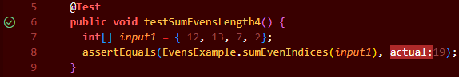

# **Greetings!**
## **Part 1**
Code for `StringServer`:
``` java
import java.io.IOException;
import java.net.URI;

class Handler implements URLHandler {
    // The one bit of state on the server: a number that will be manipulated by
    // various requests.
    int num = 0;
    String msg = "";

    public String handleRequest(URI url) {
        if (url.getPath().equals("/")) {
            return String.format("Muddassir's number: %d", num);
        } else if (url.getPath().equals("/increment")) {
            num += 1;
            return String.format("Number incremented!");
        } else if (url.getPath().equals("/add-message") && url.getQuery().startsWith("s=")) {
            String query = url.getQuery()/*.split("&")[0] */.split("=")[1];
            msg += query + "\n";
            return msg;
        } else {
            System.out.println("Path: " + url.getPath());
            if (url.getPath().contains("/add")) {
                String[] parameters = url.getQuery().split("=");
                if (parameters[0].equals("count")) {
                    num += Integer.parseInt(parameters[1]);
                    return String.format("Number increased by %s! It's now %d", parameters[1], num);
                }
            }
            return "404 Not Found!";
        }
    }
}

class StringServer {
    public static void main(String[] args) throws IOException {
        if (args.length == 0) {
            System.out.println("Missing port number! Try any number between 1024 to 49151");
            return;
        }

        int port = Integer.parseInt(args[0]);

        Server.start(port, new Handler());
    }
}
```

Examples of `StringServer`:


In this screenshot, the methods we use are url.getPath(), which also uses the methods of .equals() to see if a part of the url, which is another value, is what we are looking for. We also used the likes of .split(), specifically .split("=") which along with .startsWith("s="), we are able to grab whatever comes after it. Regarding the values of relevant fields, we firstly set the String msg to a blank string, so that we can add to it as we please.

---


In this screenshot, we are using many of the same methods, {url.getPath(), .equals(), .split(), .startsWith()}, but the main difference is  the line --> `msg += query + "\n"`; by doing this, it is appending and it changes at each request, adding to the previous string input we included. The value from the first input is appended, and it awaits the second input to include on a seperate line under the first one. 


## **Part 2**

This code displays a failure-inducing input for the buggy program
``` java
  @Test 
  public void testSumEvensLength4() {
    int[] input1 = { 12, 13, 7, 2};
    assertEquals(EvensExample.sumEvenIndices(input1), 19);
  }
```
The result of the code above (It fails): 


As you can see to the right of the code, the code expected the value 19 (the correct value), but instead got the number 15. 

---
This code doesnt not display a failure-inducing input for the buggy program
``` java
  @Test
  public void testSumEvenLength6() {
    int[] input1 = { 12, 13, 7, 8, 5, 3};
    assertEquals(EvensExample.sumEvenIndices(input1), 24);
  }
```
The result of the code above (It passes): 


As you can see to the left of the code, there is a green check mark, meaning after we run the test, it sucessfully passes, and returns the same value, which is 24. 

To fix the code to acommadate the bug in the first test, we simply change a small error:

Before:
``` java
class EvensExample {
  static int sumEvenIndices(int[] nums) {
    int sum = 0;
    for(int i = 0; i < nums.length; i += 2) {
      sum += nums[i + 1];
    }
    return sum;
  }
}
```

After:
``` java
class EvensExample {
  static int sumEvenIndices(int[] nums) {
    int sum = 0;
    for(int i = 0; i < nums.length; i += 2) {
      sum += nums[i];
    }
    return sum;
  }
}
```

If you noticed, the only thing that changed was the line where we updated the sum value. In the original code, it does `i + 1`, which updates the code from being an already even index to becoming an odd index, which means it takes the odd value instead of the even ones. To fix this, simply remove the `+1`, and the test passes with flying colors!



## **Part 3**
In the past two weeks, I did not know you are able to update the info of a webpage with methods inputted through the URL. I assumed to update the contents of a webpage, you would need to go to the specific code and input it there, but to be able to change the value from the site itself was pretty cool. Setting up a local host 4000 was also foreign to me, but I have heard it being mentioned, but now I understand how these localhosts work. I also didn't know browsers usually run on 80 or 443, so that was cool to know. 
